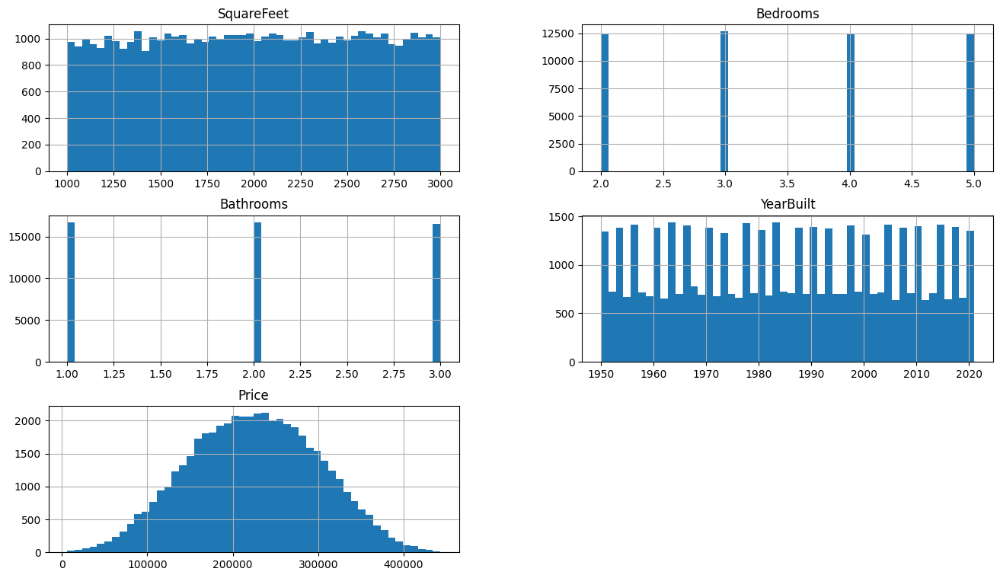
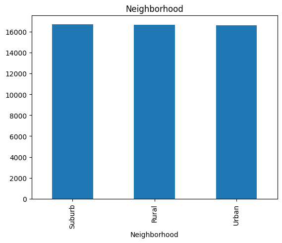
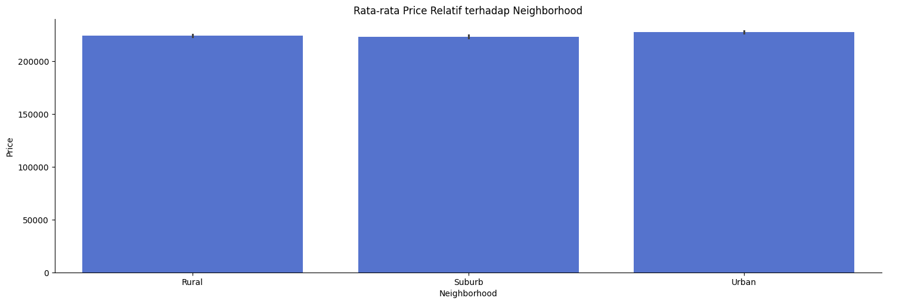
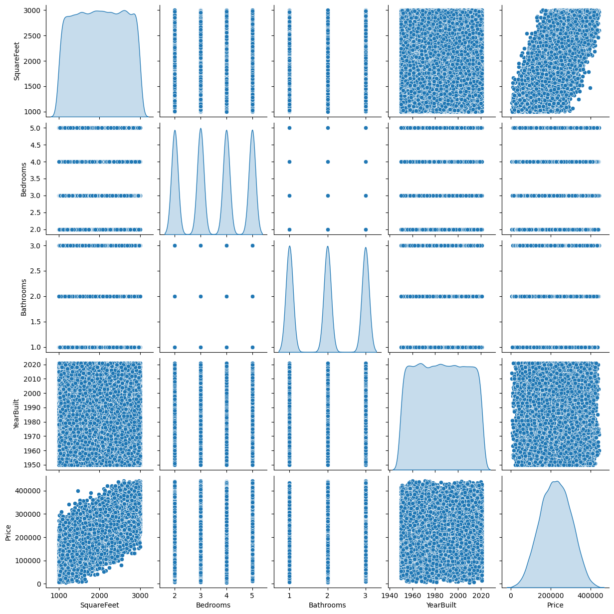
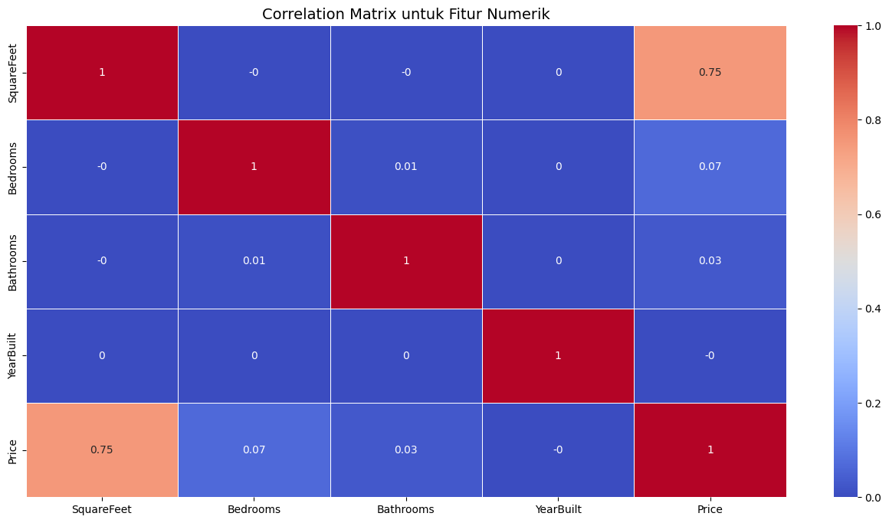
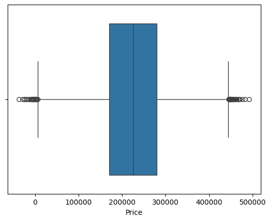
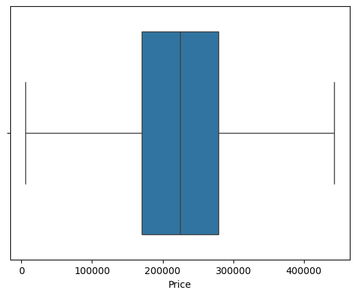

## Domain Proyek
Permintaan terhadap hunian yang layak dan terjangkau terus meningkat seiring dengan pertumbuhan populasi dan urbanisasi, termasuk di Indonesia. Laporan Bank Indonesia (BI) mencatat bahwa penjualan properti residensial tumbuh sebesar 0,73% (year-on-year) pada triwulan I 2025, membaik dibandingkan kontraksi 15,09% pada kuartal sebelumnya [1].

Dalam proses jual beli properti, penentuan harga rumah menjadi aspek krusial yang memengaruhi keputusan konsumen maupun pelaku industri properti. Namun, harga rumah dipengaruhi oleh berbagai faktor seperti lokasi, luas bangunan, jumlah kamar, kondisi bangunan, serta variabel lingkungan lainnya, sehingga proses penentuan harga yang akurat tidaklah sederhana. Kesalahan dalam estimasi harga rumah dapat berdampak besar, baik bagi penjual yang mungkin menetapkan harga terlalu rendah dan merugi, maupun bagi pembeli yang berpotensi membayar lebih dari nilai wajar properti. 

Untuk mengatasi tantangan ini, dibutuhkan pendekatan yang objektif dan berbasis data, salah satunya dengan memanfaatkan teknologi machine learning. Berbagai algoritma regresi seperti Linear Regression, Random Forest, dan Gradient Boosting telah digunakan secara luas untuk membangun model prediksi harga rumah. Penting untuk memilih pendekatan yang paling sesuai dengan kebutuhan dan karakteristik dataset karena setiap model memiliki keunggulan masing-masing dalam konteks tertentu, dan kinerjanya sangat dipengaruhi oleh karakteristik data serta parameter model yang digunakan.

Referensi:

[1] Departemen Komunikasi. (2025). Survei Harga Properti Residensial Triwulan I 2025: Harga Properti Residensial Tumbuh Terbatas. Bank Indonesia. https://www.bi.go.id/id/publikasi/ruang-media/news-release/Pages/sp_279925.aspx


## Business Understanding
Pada tahap awal proyek ini, dilakukan klarifikasi terhadap permasalahan yang ingin diselesaikan. Permasalahan yang diangkat berhubungan dengan bagaimana memprediksi harga rumah berdasarkan fitur-fitur yang tersedia dalam dataset serta memahami faktor-faktor yang memengaruhi harga tersebut.

### Problem Statements
- **Apa sajakah fitur yang paling berpengaruh terhadap harga rumah?**
    
    Terdapat banyak atribut atau fitur yang dapat memengaruhi harga rumah, seperti luas bangunan, jumlah kamar tidur, lokasi, dan tahun pembangunan. Namun, tidak semua fitur memiliki pengaruh yang signifikan. 

- **Manakah model yang paling akurat dan optimal untuk memprediksi harga rumah?**

    Untuk memberikan estimasi harga rumah yang akurat, diperlukan model prediksi yang mampu menghasilkan nilai yang sangat mendekati harga aktual, dengan kemampuan untuk generalisasi yang baik pada data baru dan tanpa overfitting/underfitting. 

### Goals
Dalam proyek ini, dilakukan serangkaian analisis dan pemodelan untuk memahami faktor-faktor yang memengaruhi harga rumah serta membangun sistem prediksi yang akurat. Adapun tujuan utama dari proyek ini mencakup:
- Mengidentifikasi fitur penting yang memengaruhi harga rumah melalui analisis statistik.
- Membangun model prediksi harga yang memanfaatkan kombinasi fitur relevan sehingga pengguna dapat memperoleh estimasi harga secara cepat dan akurat.
- Mengevaluasi dan membandingkan performa beberapa algoritma regresi untuk menentukan model dengan tingkat akurasi yang optimal serta kemampuan generalisasi yang baik terhadap data baru.

### Solution statements
Model terbaik dipilih berdasarkan keseimbangan antara akurasi yang tinggi dan kemampuan generalisasi yang baik, dengan mempertimbangkan selisih antara MSE pada data pelatihan dan pengujian untuk memastikan bahwa model tidak mengalami overfitting dan memiliki performa yang konsisten. Beberapa pendekatan diterapkan untuk mencapai tujuan utama proyek ini, yaitu sebagai berikut:

1. **Membangun dan Membandingkan Tiga Algoritma Regresi**

    Model-model yang digunakan meliputi:
    - **Linear Regression** sebagai model baseline yang sederhana dan mudah diinterpretasi.
    - **Random Forest Regressor** sebagai model ensemble berbasis bagging yang mampu menangani data non-linear dan interaksi antar fitur.
    - **Gradient Boosting Regressor** sebagai model ensemble berbasis boosting yang membangun model secara bertahap untuk meminimalkan error.

    Model akan dievaluasi menggunakan Mean Squared Error (MSE) pada data pelatihan dan pengujian untuk menilai akurasi prediksi serta kemampuan generalisasi model. 

2. **Peningkatan Performa Model Melalui Hyperparameter Tuning**

    Solusi lainnya adalah melakukan penyesuaian hyperparameter (hyperparameter tuning) untuk mendapatkan model terbaik dan meningkatkan performa lebih lanjut.
    - Untuk Random Forest, tuning mencakup parameter `n_estimators`, `max_depth`, `min_samples_split`, dan `min_samples_leaf`.
    - Untuk Gradient Boosting, tuning mencakup `n_estimators`, `max_depth`, dan `learning_rate`.

    Tuning dilakukan menggunakan pendekatan Randomized Search dengan *cross-validation* untuk menghindari overfitting. Model akan dievaluasi menggunakan MSE untuk menilai dampak tuning terhadap akurasi model. 


## Data Understanding
Dataset yang digunakan pada proyek ini adalah 'Housing Price Prediction Data' yang tersedia di [Kaggle](https://www.kaggle.com/datasets/muhammadbinimran/housing-price-prediction-data). Untuk memahami data, dilakukan beberapa tahapan yang mencakup Variabel Description, pemeriksaan dan penanganan outliers, Univariate Analysis dan Multivariate Analysis.

### Variabel Description
```
<class 'pandas.core.frame.DataFrame'>
RangeIndex: 50000 entries, 0 to 49999
Data columns (total 6 columns):
 #   Column        Non-Null Count  Dtype  
---  ------        --------------  -----  
 0   SquareFeet    50000 non-null  int64  
 1   Bedrooms      50000 non-null  int64  
 2   Bathrooms     50000 non-null  int64  
 3   Neighborhood  50000 non-null  object 
 4   YearBuilt     50000 non-null  int64  
 5   Price         50000 non-null  float64
dtypes: float64(1), int64(4), object(1)
memory usage: 2.3+ MB
```

```
 array(['Rural', 'Suburb', 'Urban'], dtype=object)
```
|           | SquareFeet | Bedrooms | Bathrooms | YearBuilt | Price            |
|-----------|------------|----------|-----------|-----------|------------------|
| Count     | 50000.000  | 50000.000| 50000.000 | 50000.000 | 50000.000        |
| Mean      | 2006.375   | 3.499    | 1.995     | 1985.404  | 224827.325       |
| Std       | 575.513    | 1.116    | 0.816     | 20.719    | 76141.843        |
| Min       | 1000.000   | 2.000    | 1.000     | 1950.000  | -36588.165       |
| 25%       | 1513.000   | 3.000    | 1.000     | 1967.000  | 169955.860       |
| 50%       | 2007.000   | 3.000    | 2.000     | 1985.000  | 225052.141       |
| 75%       | 2506.000   | 4.000    | 3.000     | 2003.000  | 279373.630       |
| Max       | 2999.000   | 5.000    | 3.000     | 2021.000  | 492195.260       |

Dataset ini cukup bersih dengan mengandung 50.000 baris dan 6 kolom, di mana 1 kolom bertipe *object*, 4 kolom bertipe *int64*, dan 1 kolom bertipe *float64*.
- SquareFeet
    - Merupakan luas bangunan rumah (ukuran total area) dalam satuan kaki persegi. Ini merupakan fitur numerik bertipe *int64*.
    - Berjumlah 50.000 sampel dengan rentang mulai dari 1000 hingga 2999. Rata-rata luas bangunan rumah adalah 2006,375 dengan standar deviasi sebesar 575,513, yang mana cukup besar dan dapat mengindikasikan bahwa luas bangunan rumah dalam sampel sangat bervariasi.

- Bedrooms
    - Merupakan jumlah kamar tidur yang tersedia pada setiap rumah. Ini merupakan fitur numerik bertipe *int64*.
    - Berjumlah 50.000 sampel dengan rentang mulai dari 2 kamar tidur hingga 5 kamar tidur. Rata-rata rumah memiliki 3,499 (3) kamar tidur dengan standar deviasi sebesar 1,116, yang mana cukup kecil dan dapat mengindikasikan bahwa jumlah kamar tidur pada setiap rumah relatif konsisten.

- Bathrooms 
    - Merupakan jumlah kamar mandi yang tersedia pada setiap rumah. Ini merupakan fitur numerik bertipe *int64*.
    - Berjumlaah 50.000 sampel dengan rentang mulai dari 1 kamar mandi hingga 3 kamar mandi. Rata-rata rumah memiliki 1,995 (2) kamar tidur dengan standar deviasi sebesar 0,816, yang mana sangat kecil dan dapat mengindikasikan bahwa sebagian besar rumah memiliki jumlah kamar mandi yang sama.

- Neighborhood
    - Merupakan jenis area lingkungan dari setiap rumah. Ini merupakan fitur non-numerik (kategorikal) bertipe *object*.
    - Berjumlah 50.000 sampel dengan 3 (tiga) pilihan utama, yakni Rural, Suburb, dan Urban.

- YearBuilt
    - Merupakan tahun pembangunan rumah. Ini merupakan fitur numerik bertipe *int64*.
    - Berjumlah 50.000 sampel dengan rentang mulai dari tahun 1950 hingga 2021. Rata-rata rumah dibangun pada tahun 1985 dengan standar deviasi sebesar 20,719, yang mana tidak terlalu kecil dan tidak terlalu besar (sedang) dan dapat mengindikasikan bahwa tahun pembangunan rumah cukup beragam tetapi tidak ekstrem.

- Price
    - Merupakan harga dari rumah. Fitur ini berperan sebagai target dan merupakan fitur numerik bertipe *float64*.
    - Berjumlah 50.000 sampel dengan rentang mulai dari -36.588,165 hingga 492.195,260. Rata-rata harga rumah berada pada 224.827,325 dengan standar deviasi sebesar 76.141,843, yang mana sangat besar dan dapat mengindikasikan bahwa harga rumah sangat bervariasi. Namun, nilai harga yang negatif dapat menunjukkan adanya outliers atau kesalahan input yang perlu diperiksa lebih lanjut.

- Seluruh kolom tidak memiliki data kosong. 

### Univariate Analysis
Berikut ini adalah hasil yang diperoleh dari Univariate Analysis:
>
>- Fitur `SquareFeet` menunjukkan penyebaran yang merata antara 1.000 hingga 3.000 kaki persegi, tanpa adanya ukuran yang secara signifikan mendominasi. Ini mencerminkan bahwa variasi ukuran rumah dalam dataset seimbang.
>- Fitur `Bedrooms` menunjukkan adanya empat kategori dalam data tersebut, yakni 2, 3, 4, dan 5 kamar tidur. Secara umum distribusinya cukup seimbang, tetapi rumah dengan 3 kamar tidur tampak sedikit lebih dominan dibandingkan kategori lainnya.
>- Fitur `Bathrooms` menunjukkan adanya tiga kategori dalam data tersebut, yakni 1, 2, dan 3 kamar mandi. Fitur ini memiliki distribusi yang cukup seimbang.
>- Fitur `YearsBulit` menunjukkan pola yang relatif konsisten dari dekade ke dekade dengan sedikit fluktuasi. Ini dapat mengindikasikan bahwa pembangunan rumah berlangsung stabil sepanjang waktu.
>- Fitur `Price` menunjukkan pola yang cukup normal dengan puncak harga berkisar pada 200.000 hingga 250.000. Namun, terdapat sedikit kemiringan ke kanan (positive skew) yang menandakan bahwa terdapat sebagian kecil rumah yang memiliki harga jauh lebih mahal. Meskipun begitu, ini umum terjadi pada data properti.

>
Fitur `Neighborhood` menunjukkan distribusi yang hampir merata di seluruh kategorinya. Jumlah sampel dalam setiap kategori lingkungan tampak seimbang yang mencerminkan bahwa cakupannya cukup representatif dari berbagai kawasan.


### Multivariate Analysis
Berikut ini adalah hasil yang diperolah dari Multivariate Analysis:

>
Berdasarkan visualisasi, rata-rata harga rumah di setiap kategori `Neighborhood` (Rural, Suburb, Urban) terlihat relatif setara. Hal ini menunjukkan bahwa variabel `Neighborhood` kemungkinan tidak memiliki pengaruh yang signifikan terhadap Price.

>
>- `Price` dan `SquareFeet` menunjukkan hubungan positif yang kuat, yakni semakin besar luas bangunan, semakin tinggi pula harga rumah. Ini mengindikasikan bahwa luas bangunan merupakan prediktor yang kuat terhadap harga.
>- `Price` dan `Bedrooms` tidak menunjukkan korelasi yang kuat, sehingga jumlah kamar tidur mungkin bukan faktor utama yang memengaruhi harga.
>- `Price` dan `Bathrooms` juga tidak menunjukkan korelasi yang berarti.
>- `Price` dan `YearBuilt` terlihat memiliki pola acak, yang mengindikasikan bahwa tidak ada hubungan korelasi yang jelas antara tahun pembangunan rumah dan harga rumah.

>
>- `Price` dan `SquareFeet` memiliki korelasi kuat sebesar 0,75, yang mana memperkuat temuan dari pairplot.
>- `Price` dan `Bedrooms` memiliki korelasi yang lemah, hanya sekitar 0,07.
>- `Price` dan `Bathrooms` juga memiliki korelasi yang lemah, sekitar 0,03.
>- `Price` dan `YearBuilt` menunjukkan korelasi negatif yang sangat kecil (-0) sehingga fitur ini akan dihapus.
>- Tidak terlihat adanya multikolinearitas signifikan antar fitur numerik sehingga dimensi tidak perlu dilakukan reduksi dimensi.

Struktur DataFrame `house` terbaru:
| Index | SquareFeet | Bedrooms | Bathrooms | Neighborhood |     Price      |
|-------|------------|----------|-----------|--------------|----------------|
|   0   |    2126    |    4     |     1     |     Rural    | 215,355.283618 |
|   1   |    2459    |    3     |     2     |     Rural    | 195,014.221626 |
|   2   |    1860    |    2     |     1     |    Suburb    | 306,891.012076 |
|   3   |    2294    |    2     |     1     |     Urban    | 206,786.787153 |
|   4   |    2130    |    5     |     2     |    Suburb    | 272,436.239065 |


## Data Preparation
Dalam menyiapkan data, terdapat beberapa tahapan penting untuk memastikan bahwa data siap digunakan oleh algoritma machine learning. Dalam proyek ini, terdapat dua tahapan utama yang dilakukan, yaitu Encoding Fitur Non-Numerik (Kategorikal) dan Train-Test Split.

### Outliers Handling
Setelah dilakukan pemeriksaan outlier pada seluruh fitur numerik, ditemukan bahwa hanya fitur Price yang mengandung outlier. Hal ini sekaligus mengonfirmasi keberadaan data yang menyimpang, yang sebelumnya telah terdeteksi di eksplorasi awal. Temuan ini menunjukkan bahwa nilai ekstrem pada harga rumah perlu ditangani secara khusus agar tidak memengaruhi hasil analisis dan akurasi model prediktif.

> Hasil pemeriksaan outlier pada fitur `Price`


Untuk membersihkan nilai outlier pada fitur `Price`, dibuat sebuah fungsi `remove_outliers()` dengan metode IQR (Interquartile Range) dalam beberapa kali iterasi (dalam kasus ini adalah 2 kali iterasi). Di dalam setiap iterasi, fungsi ini menghitung kuartil atas dan bawah (Q3 dan Q1), serta IQR (selisih antara Q3 dan Q1). Berdasarkan IQR tersebut, ditentukan batas bawah dan batas atas dengan rumus: `lower_bound = Q1 - 1.5 * IQR` dan `upper_bound = Q3 + 1.5 * IQR`. Terakhir, data yang nilainya berada di luar rentang tersebut dianggap sebagai outlier dan dihapus dari DataFrame. Adapun, beberapa kali iterasi dilakukan dalam proses ini untuk memastikan bahwa data telah sepenuhnya bersih dari nilai outlier.

> Hasil setelah dilakukan penanganan terhadap outlier pada fitur `Price`


### Encoding Fitur Numerik
Pada tahapan ini, fitur non-numerik, seperti `Neighborhood`, perlu dikonversi ke dalam format numerik agar dapat dipahami oleh model machine learning. Dalam proyek ini, proses encoding dilakukan menggunakan metode One-Hot Encoding, yakni mengubah setiap kategori dalam `Neighborhood` menjadi beberapa kolom biner (True-False).

Dalam prosesnya, fungsi `pd.get_dummies()` digunakan untuk membuat kolom-kolom baru berdasarkan setiap kategori unik dalam fitur `Neighborhood`, yaitu `Neighborhood_Rural`, `Neighborhood_Suburb`, dan `Neighborhood_Urban`. Masing-masing kolom berisi nilai biner (0/1 atau False/True) yang menunjukkan apakah suatu baris termasuk dalam kategori tersebut. Setelah proses encoding selesai, kolom asli Neighborhood dihapus dari dataset menggunakan `drop()`, karena informasi dari kolom tersebut sudah sepenuhnya direpresentasikan oleh kolom-kolom hasil encoding. Pendekatan ini penting agar model tidak salah menginterpretasikan urutan atau skala dalam data kategorikal.

Hasil setelah dilakukan One-Hot Encoding:
| Index | SquareFeet | Bedrooms | Bathrooms |     Price     | Neighborhood_Rural  | Neighborhood_Suburb  | Neighborhood_Urban  |
|-------|------------|----------|-----------|---------------|---------------------|----------------------|---------------------|
|   0   |    2126    |    4     |     1     | 215355.283618 |        True         |        False         |        False        |
|   1   |    2459    |    3     |     2     | 195014.221626 |        True         |        False         |        False        |
|   2   |    1860    |    2     |     1     | 306891.012076 |        False        |        True          |        False        |
|   3   |    2294    |    2     |     1     | 206786.787153 |        False        |        False         |        True         |
|   4   |    2130    |    5     |     2     | 272436.239065 |        False        |        True          |        False        |


### Train-Test Split
Pada tahapan ini, dataset akan dibagi menjadi data latih dan data uji untuk memastikan bahwa model dapat belajar dan diuji, serta mencegah overfitting dan memberikan gambaran performa model yang lebih objektif.

Setelah proses encoding, dilakukan pemisahan antara fitur dan target dalam dataset. Proses ini dimulai dengan menyimpan seluruh fitur di dalam variabel `X` dan menghapus kolom `Price`, yang kemudian disimpan di dalam variabel `y` sebagai target yang akan diprediksi. Setelah pemisahan ini, dataset dibagi menjadi dua bagian menggunakan fungsi `train_test_split`, yakni data latih (`X_train, y_train`) dengan proporsi 80% dari dataset, dan data uji (`X_test, y_test`) dengan proporsi 20% dari dataset. Selain itu, `random_state=123` digunakan untuk memastikan bahwa hasil pembagian data bersifat konsisten dan dapat direproduksi di setiap eksekusi. Ini merupakan langkah penting agar performa prediksi dapat diukur secara objektif pada data yang belum pernah dilihat sebelumnya.

Hasilnya:
Dari total 49.940 sampel, sebanyak 39.952 sampel dialokasikan sebagai data latih untuk melatih model agar mengenali pola dalam dataset, dan sebanyak 9.988 sampel digunakan sebagai data uji untuk mengevaluasi kinerja model pada data baru dan mencegah overfitting.

Setelah proses pembagian data, dilakukan standarisasi terhadap fitur numerik (`SquareFeet`, `Bedrooms`, `Bathrooms`) menggunakan `StandardScaler()` untuk menyamakan skala antar fitur numerik sehingga model machine learning dapat bekerja lebih optimal, terutama untuk algoritma yang sensitif terhadap skala data seperti Linear Regression (salah satu model yang akan digunakan). `StandardScaler()` mengubah distribusi fitur sehingga memiliki rata-rata 0 dan standar deviasi 1. 

Hasil standarisasi menunjukkan bahwa rata-rata nilai untuk fitur SquareFeet dan Bedrooms adalah sekitar -0, sedangkan Bathrooms mendekati 0, yang berarti proses transformasi berhasil. Adapun rentang nilai setelah standarisasi yaitu:
- `SquareFeet`: -1.7483 hingga 1.7255
- `Bedrooms`: -1.3409 hingga 1.3472
- `Bathrooms`: 1.2197 hingga 1.2308

Rentang ini menunjukkan bahwa data telah terdistribusi secara seimbang yang memungkinkan model untuk belajar dengan lebih stabil.


## Modeling
Pada tahap pemodelan, beberapa algoritma machine learning digunakan untuk menyelesaikan permasalahan prediksi harga rumah berdasarkan fitur-fitur yang tersedia. Tujuan dari penggunaan beberapa algoritma adalah untuk membandingkan performa masing-masing model dan menentukan algoritma terbaik yang dapat digunakan sebagai solusi akhir. 

Proses pemodelan dan pelatihan dilakukan melalui beberapa tahapan utama:
1. Inisialisasi model: Model machine learning yang akan digunakan, diinisialisasi sesuai dengan algoritma yang dipilih.
2. Pelatihan dengan data latih: Model dilatih menggunakan X_train sebagai fitur dan y_train sebagai target dengan tujuan dapat mengenali pola dari dataset.

### Solution 1
Dalam proyek ini, tiga algoritma utama yang diterapkan untuk *Solution 1* adalah Linear Regression (LR), Random Forest Regressor (RF), dan Gradient Boosting Regressor (GB). 
- **Linear Regression (LR)**

    Linear Regression merupakan algoritma dasar yang digunakan untuk memodelkan hubungan linier antara variabel independen dan variabel dependen (dalam hal ini, harga rumah). Model ini dibangun tanpa pengaturan parameter tambahan (menggunakan default settings). 

    Parameter:
    - Tidak ada parameter khusus yang ditentukan secara eksplisit; model dijalankan menggunakan parameter default dari `LinearRegression()`.

    Kelebihan:
    - Implementasi cepat dan sederhana.
    - Hasil model dapat dengan mudah diinterpretasikan.
    - Tidak membutuhkan banyak komputasi.

    Kekurangan:
    - Kurang efektif untuk data dengan hubungan non-linier antara fitur dan target.
    - Sensitif terhadap outlier yang dapat memengaruhi akurasi prediksi.

- **Random Forest Regressor (RF)**

    Random Forest adalah algoritma ensemble yang terdiri dari banyak pohon keputusan (decision trees) dan menghasilkan prediksi dengan cara menggabungkan hasil dari semua pohon. Dalam proyek ini, model dikonfigurasi dengan beberapa parameter untuk menghindari overfitting dan mengoptimalkan kinerja. 

    Parameter:
    - `n_estimators=60`: Jumlah pohon dalam hutan adalah 60.
    - `random_state=42`: Nilai acak untuk menjaga konsistensi hasil setiap kali kode dijalankan ulang.

    Kelebihan:
    - Dapat menangani hubungan non-linier antara fitur dan target.
    - Lebih tahan terhadap overfitting dibandingkan decision tree tunggal.
    - Dapat menangani data dengan noise atau outlier dengan lebih baik.

    Kekurangan:
    - Membutuhkan waktu dan sumber daya komputasi yang lebih besar.
    - Interpretasi model menjadi lebih sulit karena kompleksitas struktur pohon.

- **Gradient Boosting Regressor (GB)**

    Gradient Boosting merupakan algoritma ensemble lain yang bekerja secara bertahap. Setiap model yang baru dibangun berfokus pada memperbaiki kesalahan dari model sebelumnya, sehingga mampu meningkatkan akurasi secara progresif.

    Parameter:
    - `random_state=42`: Nilai acak untuk menjaga konsistensi hasil setiap kali kode dijalankan ulang.

    Kelebihan:
    - Sangat efektif dalam menangani hubungan non-linier dan kompleks.
    - Umumnya menghasilkan performa prediksi yang tinggi.

    Kekurangan
    - Proses pelatihan lebih lama dibandingkan model lain.
    - Rentan terhadap overfitting jika tidak dilakukan pengaturan parameter secara tepat.

### Solution 2
Setelah dilakukan tuning hyperparameter, diperoleh konfigurasi terbaik untuk model Random Forest dan Gradient Boosting sebagai berikut.

- **Tuned Random Forest**

    Parameter:
    - `max_depth=5`: Membatasi kedalaman pohon hingga 5 level.
    - `min_samples_leaf=2`: Setiap daun pohon harus memiliki minimal 2 sampel.
    - `min_samples_split=10`: Minimal mengandung 10 sampel untuk membagi node.
    - `n_estimators=50`: Jumlah pohon dalam hutan adalah 50.
    - `random_state=42`: Nilai acak untuk menjaga konsistensi hasil setiap kali kode dijalankan ulang.

- **Tuned Gradient Boosting**

    Parameter:
    - `learning_rate=0.05`: MMengatur laju pembelajaran model pada 0.05.
    - `max_depth=5`: Membatasi kedalaman setiap pohon hingga 5 level.
    - `random_state=42`: Nilai acak untuk menjaga konsistensi hasil setiap kali kode dijalankan ulang.


## Evaluation
Setelah seluruh model selesai dilatih, performanya dievaluasi menggunakan metrik **Mean Squared Error (MSE)**. Model terbaik dipilih berdasarkan kemampuan generalisasi, yang diukur dari selisih MSE antara data pelatihan dan pengujian, serta seberapa dekat hasil prediksi dengan nilai aktual.

### Metrik MSE
Mean Squared Error (MSE) merupakan metrik yang menghitung rata-rata dari kuadrat selisih antara nilai aktual dan nilai prediksi. Metrik ini memberikan penalti yang lebih besar terhadap kesalahan prediksi yang besar, sehingga sangat efektif untuk mendeteksi model yang membuat prediksi yang ekstrem.
Formula MSE secara matematis dituliskan sebagai berikut:
$$
\text{MSE} = \frac{1}{n} \sum_{i=1}^{n} (y_i - \hat{y}_i)^2
$$

dengan:
- $y_i$ adalah nilai aktual dari data.
- $\hat{y}_i$ adalah nilai prediksi dari model.
- $n$ adalah jumlah total sampel dalam dataset.

Semakin kecil nilai MSE, maka akan semakin baik performa model. Dengan kata lain, kesalahan rata-rata prediksi terhadap data aktual semakin kecil. 

### Hasil Evaluasi Solution 1
Berikut adalah hasil evaluasi MSE yang dilakukan terhadap tiga model utama, yaitu Linear Regression (LR), Random Forest Regressor (RF), dan Gradient Boosting Regressor (GB):
| Model | MSE (Train)      | MSE (Test)       |
|-------|------------------|------------------|
| LR    | 247.463,437455   | 244.633,604985   |
| RF    |   82.999,97236   | 317.759,484147   |
| GB    | 245.017,057283   | 245.068,287107   |

- Linear Regression (LR) dan Gradient Boosting (GB) menunjukkan nilai MSE yang relatif seimbang antara data pelatihan dan pengujian, dengan selisih kecil, yang mengindikasikan kemampuan generalisasi yang cukup baik.
- Random Forest (RF) memiliki MSE yang sangat rendah pada data pelatihan (82.999), tetapi sangat tinggi pada data pengujian (317.759). Ini menunjukkan adanya overfitting, di mana model belajar terlalu baik pada data latih namun gagal mempertahankan performanya pada data baru.
- Secara keseluruhan, Gradient Boosting tampak sebagai model yang paling stabil dan seimbang dengan MSE train-test yang nyaris sama sehingga lebih andal untuk prediksi di data nyata.

Selanjutnya, prediksi terhadap data uji dilakukan untuk mengevaluasi lebih lanjut performa dari masing-masing model. Hasil prediksi dari ketiga model dibandingkan dengan nilai aktual (y_true) ditunjukkan pada tabel berikut:
|     | y_true       |  prediksi_LR | prediksi_RF | prediksi_GB |
|-----|--------------|--------------|-------------|-------------|
|39738|316040.899494 | 305079.8     | 309846.8    |  306072.0   |  

Dari hasil di atas, model Random Forest (RF) menghasilkan prediksi yang paling mendekati nilai aktual dengan selisih sekitar ~6.194, disusul oleh Gradient Boosting (GB) dengan selisih ~9.969, dan Linear Regression (LR) dengan selisih ~10.961.
Namun, mengingat bahwa model Random Forest (RF) menunjukkan indikasi overfitting berdasarkan selisih yang besar antara MSE pelatihan dan pengujian, performanya berpotensi tidak konsisten saat diuji pada data baru. Sebaliknya, Gradient Boosting menunjukkan performa yang lebih konsisten dan stabil sehingga model ini lebih direkomendasikan untuk prediksi yang membutuhkan kemampuan generalisasi yang baik.

### Hasil Evaluasi Solution 2
Berikut adalah hasil evaluasi MSE terhadap model Random Forest (RF) dan Gradient Boosting (GB) setelah dilakukan tuning:
| Model       | MSE (Train)     `| MSE (Test)       |
|-------------|------------------|------------------|
| Tuner_RF    | 246.917,765664   | 246.255,769967   |
| Tuned_GB    | 242.748,470914   | 245.311,248215   |

- Setelah dilakukan penyesuaian parameter (tuning), model Random Forest (RF) menunjukkan selisih MSE antara data pelatihan dan pengujian yang sangat kecil (sekitar 662). Hal ini mengindikasikan bahwa model memiliki stabilitas dan kemampuan generalisasi yang sangat baik, tanpa tanda-tanda overfitting maupun underfitting. Selain itu, performa model hampir identik di kedua data yang dapat mencerminkan bahwa model sangat andal.
- Model Gradient Boosting (GB) juga menunjukkan performa yang baik setelah tuning, dengan selisih MSE antara data pelatihan dan pengujian sebesar sekitar 2.563. Meskipun sedikit lebih besar dibandingkan RF, selisih ini tetap tergolong kecil dan menunjukkan bahwa model memiliki kemampuan generalisasi yang solid, serta tidak mengalami overfitting secara signifikan.

Selanjutnya, prediksi terhadap data uji dilakukan untuk mengevaluasi lebih lanjut performa dari masing-masing model. Hasil prediksi dari model setelah tuning dibandingkan dengan nilai aktual (y_true) ditunjukkan pada tabel berikut:
|     | y_true       |  prediksi_Tuned_LR | prediksi_Tuned_GB |
|-----|--------------|--------------------|-------------------|
|39738|316040.899494 | 313515.3           | 309166.8          |  

Dari hasil di atas, model Tuned Random Forest (RF) menghasilkan prediksi yang paling mendekati nilai aktual, dengan selisih sekitar 2.526, disusul oleh Tuned Gradient Boosting (GB) dengan selisih sekitar 6.874.
Kedua model menunjukkan performa yang cukup baik setelah dilakukan tuning, namun Tuned RF memberikan prediksi yang lebih akurat pada data ini. Selain itu, berdasarkan evaluasi MSE sebelumnya, keduanya juga menunjukkan kemampuan generalisasi yang baik, sehingga keduanya layak dipertimbangkan untuk implementasi lebih lanjut.


## Kesimpulan
- Dalam proyek prediksi harga rumah ini, ukuran rumah (SquareFeet) terbukti menjadi faktor utama yang memengaruhi harga, sementara variabel lainnya seperti fasilitas kamar tidur, kamar mandi, serta area lingkungan rumah memiliki kontribusi yang minimal. 
- Setelah melakukan evaluasi dan perbandingan berbagai model, termasuk model yang telah di-tuning, model Tuned Random Forest (solution 2) dipilih sebagai model paling optimal untuk diterapkan dalam prediksi harga rumah. Model ini tidak hanya menghasilkan prediksi yang sangat mendekati nilai aktual, tetapi juga menunjukkan kemampuan generalisasi yang baik tanpa mengalami overfitting.